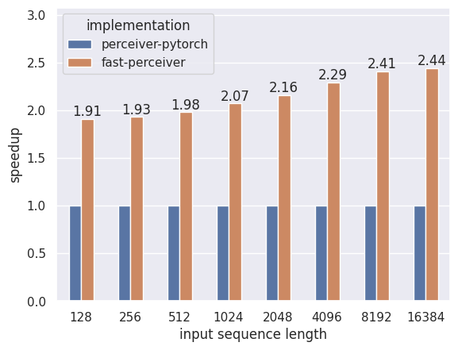

fast-perceiver
=========================

Fast and memory efficient PyTorch implementation of the Perceiver [1, 2, 3] attention architecture with FlashAttention [4, 5].

Features:

* ⚡ More than 2x speedup over naive implementation
* ⚡ Sub-linear[^1] memory usage with respect to input sequence length and linear memory usage with respect to number of latent vectors
* ⚡ Out-of-the-box support for rotary positional embeddings [6]
* ⚡ Use new and improved FlashAttention-2 implementation
* ⚡ Supports arbitrary masking of inputs

[^1]. For the attention components. See [Performance](#Performance) for more information.

Installation
------------

```bash
pip install fast-perceiver
```

[FlashAttention](https://github.com/Dao-AILab/flash-attention) will be installed as part of the dependencies and may have to be compiled locally. Note that this may take a while and fail for unsupported GPUs or CUDA versions. Please refer to the linked repository for further information and help with the installation.

Usage
-----

```python
import torch

from fast_perceiver import Perceiver

in_dim = 256
out_dim = 128

latent_dim = 512
num_latents = 512

model = Perceiver(
    input_dim=in_dim,
    depth=8,
    out_dim=out_dim,
    num_latents=num_latents,
    latent_dim=latent_dim,
    cross_heads=1,
    cross_head_dim=64,
    latent_heads=8,
    latent_head_dim=64,
    cross_attn_dropout=0.0,
    self_attn_dropout=0.0,
    weight_tie_layers=False,
    gated_mlp=True,
).cuda()

x = torch.randn(32, 128, in_dim).cuda()

# FlashAttention only works with half-precision
# Don't forget to autocast!
with torch.autocast('cuda'):
    # `out_dim`` specified; averages and projects output
    out = model(x)

    assert out.shape == (32, out_dim)

    # The raw final latents will be returned when `return_embeddings=True`
    embeds = model(x, return_embeddings=True)

    assert embeds.shape == (32, num_latents, latent_dim)
```

Performance
-----------

The Perceiver is already designed and intended as a attention architecture with sub-quadratic compute and memory complexity in comparison to the quadratic requirements of a vanilla Transformer.

A naive implementation will have $\mathcal{O}(nm)$ memory requirements for the cross-attention modules and $\mathcal{O}(n^2)$ complexity for the self-attention or _latent_ blocks, where $n$ is the number of latent vectors (fixed hyperparameter) and $m$ is the number of input elements.

FlashAttention allows a memory usage reduction to $\mathcal{O}(n)$ for the cross-attention layers and $\mathcal{O}(n)$ for the self-attention layers. However, this only accounts for the computation of the attention mechanisms. The input sequence and corresponding keys and values within the cross-attention modules will still grow with $m$.

Until the latter starts to dominate memory usage, this implementation allows to greatly scale the input sequence length. For instance, 16x larger input lengths can be achieved in comparison to [perceiver-pytorch](https://github.com/lucidrains/perceiver-pytorch) on a RTX 4090, keeping the other hyperparameters fixed (see `run_benchmarks.py` for the exact configuration).

### Benchmarks

Benchmarks against other implementations (currently only `perceiver-pytorch`) can be performed with:

```bash
python run_benchmarks.py
```

The script will create a `benchmark_results.csv`. The `create_plots.py` script can then be used to create plots.

The following plots have been created using a single RTX 4090 with 24GB of VRAM.




**Note:** The batch size for each configuration corresponds to the smallest value that works for all implementations. Especially for longer sequence lengths, this leads to decreasing GPU utilization and thus a lower speedup than theoretically possible. There are some ways to fix this, but my attempts so far have led to distorted results.

Acknowledgements
----------------

The implementation is inspired by lucidrain's [Perceiver implementation](https://github.com/lucidrains/perceiver-pytorc) and would not have been possible without Tri Dao's [FlashAttention](https://github.com/Dao-AILab/flash-attention).

Planned features
---------------

These are a few features that are either planned or WIP. If you have urgent demand for some of them, feel free to write an issue:

- [ ] Perceiver IO [2] [WIP]
- [ ] Perceiver AR [3] (or an AR demo in general)
- [ ] Demos [WIP]
- [ ] Tests [WIP]
- [ ] Allow more flexible cross-attention configurations
- [ ] Benchmarks against other Perceiver implementations, e.g. [DeepMind's](https://github.com/deepmind/deepmind-research/tree/master/perceiver) or [Krasser's](https://github.com/krasserm/perceiver-io)

References
----------

[1] Jaegle, Andrew, Felix Gimeno, Andrew Brock, Andrew Zisserman, Oriol Vinyals, and Joao Carreira. “Perceiver: General Perception with Iterative Attention.” arXiv, June 22, 2021. http://arxiv.org/abs/2103.03206.

[2] Jaegle, Andrew, Sebastian Borgeaud, Jean-Baptiste Alayrac, Carl Doersch, Catalin Ionescu, David Ding, Skanda Koppula, et al. “Perceiver IO: A General Architecture for Structured Inputs & Outputs.” arXiv, March 15, 2022. http://arxiv.org/abs/2107.14795.

[3] Hawthorne, Curtis, Andrew Jaegle, Cătălina Cangea, Sebastian Borgeaud, Charlie Nash, Mateusz Malinowski, Sander Dieleman, et al. “General-Purpose, Long-Context Autoregressive Modeling with Perceiver AR.” arXiv, June 14, 2022. http://arxiv.org/abs/2202.07765.

[4] Dao, Tri, Daniel Y. Fu, Stefano Ermon, Atri Rudra, and Christopher Ré. “FlashAttention: Fast and Memory-Efficient Exact Attention with IO-Awareness.” arXiv, June 23, 2022. https://doi.org/10.48550/arXiv.2205.14135.

[5] Dao, Tri. “FlashAttention-2: Faster Attention with Better Parallelism and Work Partitioning.” arXiv, July 17, 2023. https://doi.org/10.48550/arXiv.2307.08691.

[6] Su, Jianlin, Yu Lu, Shengfeng Pan, Ahmed Murtadha, Bo Wen, and Yunfeng Liu. “RoFormer: Enhanced Transformer with Rotary Position Embedding.” arXiv, August 8, 2022. https://doi.org/10.48550/arXiv.2104.09864.
